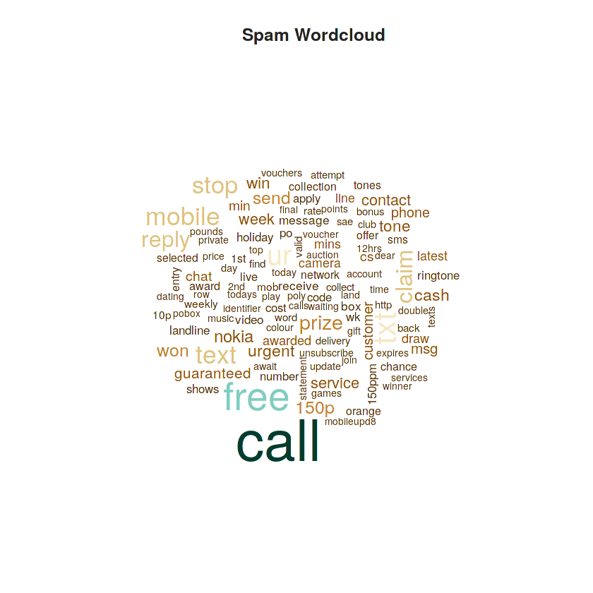
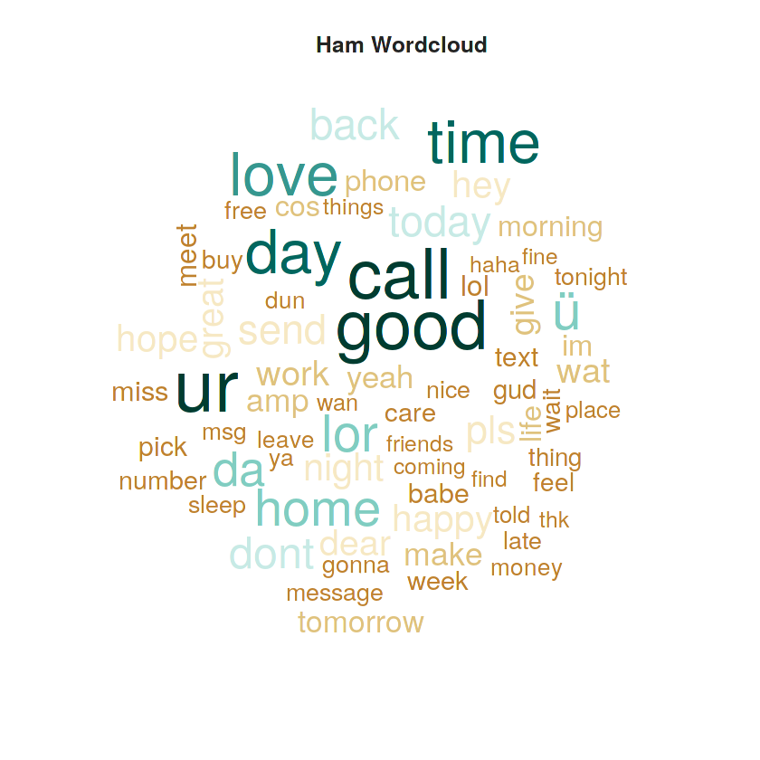

**We'll construct a spam filter which we can use to classify text messages as ham or spam -- that is, legitimate versus junk mail messages.
using <a href = "https://stackoverflow.com/questions/10059594/a-simple-explanation-of-naive-bayes-classification">naive bayes</a>**
<p>&nbsp;</p>
<p>&nbsp;</p>

Need installation of new packages if you don't have them already 

required packages 
```{r setup, include=TRUE }
library(quanteda)
library(RcppArmadillo)
library(RColorBrewer)
library(quanteda.textmodels)
```  


<p>&nbsp;</p>
<p>&nbsp;</p>

reading input data
```{r}
raw.data <- read.csv("data/emails.csv",
                     header=TRUE, sep=",", quote='\"\"', stringsAsFactors=FALSE)

```  

<p>&nbsp;</p>
<p>&nbsp;</p>

Let's print the heading and let's add headers to the two columns of information. We'll call the first column "Category" and the second column "Message" as it appears in the heading without any changes.

```{r, results=FALSE}
names(raw.data) <- c("Category", "Message")
raw.data[1,]
```  

Category | Massage
--- | --- 
ham | Go until jurong point, crazy.. Available only in bugis n great world la e buffet... Cine there got amore wat...


<p>&nbsp;</p>
<p>&nbsp;</p>
Let's sample the data import phase.It is to randomize our data using the sample() command. Just in case the data are not stored in a random distribution, this will help to ensure that we are dealing with a random draw from our data. The set.seed() command is simply there to ensure more consistent replication


```{r}
#taking a sample of data becaause the full data s too large to model
set.seed(1912)  
raw.data <- raw.data[sample(nrow(raw.data)),]
```


<p>&nbsp;</p>
<p>&nbsp;</p>

Data visualization In natural language processing, we like to deal with corpus objects. A corpus can be thought of as a master copy of our dataset from which we can pull subsets or observations as needed. We'll use quanteda's corpus() command to construct a corpus from the Text field of our raw data, which we can name sms.corpus. Then, attach the Label field as a document variable to the corpus using the docvars() command. We attach Label as a variable directly to our corpus so that we can associate SMS messages with their respective ham/spam label later in the analysis.


```{r}
# making a corups to supset from it later 
sms.corpus <- corpus(raw.data$Message) 
docvars(sms.corpus, "Category" ) <- raw.data$Category
```

<p>&nbsp;</p>
<p>&nbsp;</p>

Creating a spam cloud 

```{r eval=FALSE, warning=FALSE, , results=FALSE}
#creating a spam cloud 
spam.plot <- corpus_subset(sms.corpus  ,Category == "spam")  
spam.plot <- dfm(spam.plot, tolower = TRUE, remove_punct = TRUE,
                 remove_twitter = TRUE, remove_numbers = TRUE,
                 remove=stopwords(source = "smart"))
#plot the spam cloud 
spam.col <- brewer.pal(10, "BrBG")  
spam.cloud <- textplot_wordcloud(spam.plot, min_count = 16, color = spam.col)  
title("Spam Wordcloud", col.main = "grey14")
```


<p>&nbsp;</p>
<p>&nbsp;</p>

Creating a ham cloud 

```{r eval=FALSE, warning=FALSE, , results=FALSE}
#create a ham cloud 
ham.plot <- corpus_subset(sms.corpus, Category == "ham")  
ham.plot <- dfm(ham.plot, tolower = TRUE, removePunct = TRUE,
                removeTwitter = TRUE, removeNumbers = TRUE,
                remove=c("gt", "lt", stopwords(source= "smart")))  
#plot the ham cloud 
ham.col <- brewer.pal(10, "BrBG")  
ham.cloud = textplot_wordcloud(ham.plot, min_count = 50, color = ham.col )  
title("Ham Wordcloud", col.main = "grey14")
```

<p>&nbsp;</p>
<p>&nbsp;</p>

The prediction

We will use a simple naive Bayes classifier for this task. For more information on Bayesian classifiers, see this [StackOverflow post](https://stackoverflow.com/questions/10059594/a-simple-explanation-of-naive-bayes-classification). In short, Bayesian classifiers are simple probabilistic classifiers based on Bayes' theorem with strong feature independence assumptions.


```{r warning=FALSE, , include=TRUE}
sms.dfm <- dfm(sms.corpus, tolower = TRUE)  
sms.dfm <- dfm_trim(sms.dfm, min_count = 5, min_docfreq = 0.5)  
sms.dfm <- dfm_weight(sms.dfm)  

#splitting the data as a train part and test part 
sms.raw.train <- raw.data[1:4738,]  
sms.raw.test <- raw.data[4739:nrow(raw.data),]

#making a naive bayse model with the train data 
sms.classifier <- textmodel_nb(sms.dfm.train , sms.raw.train$Category)  

#predicting on the test data 
sms.predictions <- predict(sms.classifier, newdata = sms.dfm.test)  
table(sms.predictions, sms.raw.test$Category)
```
<p>&nbsp;</p>
This table should be read from left to right: The model classified 708 ham messages correctly as ham, and 7 ham messages incorrectly as spam. The model incorrectly classified 11spam messages as ham, but 108 spam messages correctly as spam.

By dividing the correct number of classifications by the total number of classifications attempted, we find that our model correctly classifies **99%** of ham messages and **90.7%**of spam messages.


